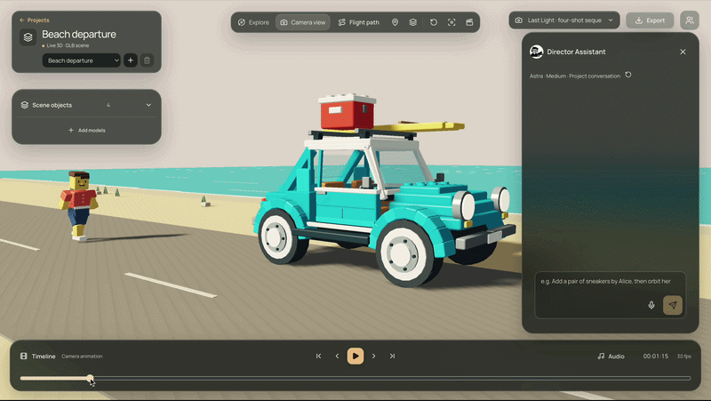

<div align="center">

# Camvas

### Build the scene. Direct the camera. Render the film.

An AI-assisted 3D filmmaking studio in your browser.

[Live Demo](https://flythru-production.up.railway.app/) · [Watch the Films](https://flythru-production.up.railway.app/films) · [Getting Started](#getting-started) · [Documentation](#documentation)




*From an editable 3D scene to a finished cinematic shot.*

</div>

Camvas brings scene composition, camera choreography, animation, sound, and video export into one workspace. Start with a Gaussian splat of a real place, a Sketchfab model, or your own GLB. Shape the shot with editable camera marks and landmarks, ask the AI Director to help, and render the result directly in your browser.

## The Problem

A cinematic idea can take several tools to realize: find or build a scene, arrange objects, animate subjects, plan a camera path, add music, and export a video. Each handoff makes it harder to experiment with the shot as a whole.

Camvas puts those decisions around a live 3D viewport. You can see the scene, adjust its timing, direct the camera, and review the result in the same place. AI proposals become editable scene actions, so the final composition stays under your control.

## Key Features

| Capability | What you can do |
| --- | --- |
| **Real places and 3D assets** | Explore streamed SuperSplat captures, search Sketchfab, import local GLB models, or compose a scene on the studio stage. |
| **AI Director** | Describe a change in natural language. The Director proposes structured actions that the editor validates before applying to the scene. |
| **Camera choreography** | Start from one of 39 camera presets or capture your own views. Edit marks, lenses, aim, roll, cuts, and route landmarks. |
| **Animation and blocking** | Give actors timed movement marks, attach props to actors, and add turntable or floating motion to props. |
| **Cinematic finishing** | Shape studio lighting, grade the image, adjust depth of field and bloom, and add titles, letterboxing, and fades. |
| **Sound on the timeline** | Search Jamendo music and Freesound effects, then place, trim, fade, and mix clips with the shot. |
| **Live collaboration** | Join a shared room with Yjs and WebRTC for synchronized editing fields, presence, and cursors. |
| **Browser video export** | Render up to 4K with supersampling and optional motion blur. Export H.264/AAC MP4, with WebM fallback where supported. |
| **Editable projects** | Save multi-scene projects in the browser and exchange versioned JSON project files. |

## Made with Camvas

The [Films gallery](https://flythru-production.up.railway.app/films) includes:

- **Last Light** — a golden-hour coastal departure, shown in the demo above.
- **Skyline Slalom** — a 36-second San Francisco flight with a pigeon crossing and Golden Gate reveal.
- **Thames Air** — a 20-second flight through Tower Bridge's central opening, followed by a right turn into a widening London panorama, built around a real Gaussian splat.
- **Fuse Warmup** — a character study inside a scanned gym.
- **A Little Tending** — a quiet camera flight through a greenhouse garden.

## Architecture Overview

```text
  REAL-WORLD CAPTURES         3D ASSETS              SOUND
  SuperSplat / Gaussians      Sketchfab / GLB        Jamendo / Freesound
            |                      |                        |
            +----------------------+------------------------+
                                   |
                                   v
  +----------------------------------------------------------------+
  |                       CREATIVE WORKSPACE                       |
  |                                                                |
  |       Next.js 16 / React 19 / TypeScript 7 / CSS Modules       |
  |    Scene Editor / Camera Choreography / Blocking / Timeline    |
  +----------------------------------------------------------------+
                                   |
                  +----------------+----------------+
                  |                                 |
                  v                                 v
  +-------------------------------+  +-----------------------------+
  |          AI DIRECTION         |  |        SPATIAL ENGINE       |
  |                               |  |                             |
  |         Codex Director        |  |          PlayCanvas         |
  |   Structured scene proposals  |  |    Gaussian splats + GLB    |
  |   Validation + visual review  |  |    Streaming / animation    |
  |       Node.js API routes      |  |    Three.js spatial math    |
  |  Optional CinemaTraj / Python |  |      Blockout geometry      |
  +-------------------------------+  +-----------------------------+
                  |                                 |
                  +----------------+----------------+
                                   |
                                   v
  +----------------------------------------------------------------+
  |                       LIVE PROJECT CORE                        |
  |                                                                |
  |      Yjs + WebRTC                 Deterministic playback       |
  |      Shared fields + presence     Versioned JSON projects      |
  |   Plain-data contracts         Browser save + import/export    |
  +----------------------------------------------------------------+
                                   |
                                   v
  +----------------------------------------------------------------+
  |                          FINAL FRAME                           |
  |                                                                |
  |       Web Audio -> Offline Mix -> WebCodecs + Mediabunny       |
  |          Supersampling / Motion Blur / Titles / Fades          |
  |                       MP4 / WebM Export                        |
  +----------------------------------------------------------------+
```

The editor coordinates features through plain-data contracts. PlayCanvas owns rendering and viewport interaction; Three.js supports camera and geometry math. Camera paths are evaluated deterministically for both preview and export. See [module boundaries and data flow](docs/architecture.md) for implementation details.

## Technology Stack

| Layer | Technology |
| --- | --- |
| **Application** | Next.js 16 App Router, React 19, TypeScript 7 |
| **Interface** | CSS Modules, Motion, Lucide, self-hosted Manrope |
| **3D rendering** | PlayCanvas, WebGPU where supported, WebGL2 fallback |
| **Camera and geometry** | Three.js math, adapted Blockout camera algorithms and primitive builders |
| **AI** | Local Codex app-server for the Director, semantic labeling, and automatic flight planning; optional Gemini-backed planning API |
| **Path optimization** | Optional CinemaTraj Python/CPU integration |
| **Collaboration** | Yjs CRDTs, y-webrtc, awareness presence |
| **Media** | Web Audio, WebCodecs, Mediabunny |
| **Asset services** | SuperSplat, Sketchfab, Jamendo, Freesound |
| **Deployment** | Node.js and Railway; browser-side project persistence |
| **Validation** | TypeScript, headless module tests, Playwright, axe-core |

## Getting Started

### Prerequisites

- Node.js **20.9 or newer** and npm.
- A modern browser with WebGL2 or WebGPU. Video export also needs browser encoding support through WebCodecs.
- Optional service credentials for model downloads, audio search, and AI features. Basic local scene editing does not require them.

### Installation

```sh
git clone https://github.com/amyhakim/Camvas.git
cd Camvas
npm ci
cp .env.example .env.local
npm run dev
```

Open [localhost:3000](http://localhost:3000), create a project, and choose a scene. The [Films tab](http://localhost:3000/films) contains finished examples; the [design system](http://localhost:3000/design-system) shows the reusable interface components.

### Optional Integrations

Add only the credentials for the services you want to use to `.env.local`:

| Setting | Enables |
| --- | --- |
| `SKETCHFAB_API_TOKEN` | Downloading supported Sketchfab models; search works without a token. |
| `JAMENDO_CLIENT_ID` | Music search and import. |
| `FREESOUND_API_KEY` | Sound-effect search and import. |
| `GEMINI_API_KEY` | The optional `/api/plan` shot-settings endpoint. |
| `NEXT_PUBLIC_COLLAB_SIGNALING_URLS` | Custom WebRTC signaling servers; omit to use the prototype default. |
| `CINEMATRAJ_ROOT`, `CINEMATRAJ_PYTHON` | The optional local trajectory optimizer. See the [setup guide](docs/editor-guide.md#optional-cinematraj-cpu-path). |
| `GPU_WORKER_URL`, `GPU_WORKER_TOKEN` | An optional external optimization worker implementing the [backend contract](docs/backend.md). |

The **AI Director** uses an authenticated Codex CLI on the machine running the Next.js server. Its launch requirements and supported scene actions are described in [Talk to the director](docs/editor-guide.md#talk-to-the-director). `CODEX_BIN` can select a custom executable. A Gemini key does not configure the Director.

### Make Your First Shot

1. **Choose the scene.** Open a starter, a streamed capture, or the studio stage; add models as needed.
2. **Compose the action.** Place objects and set actor movement marks on the timeline.
3. **Direct the camera.** Capture the current view, choose a preset, or ask the Director for a move. Refine the camera marks and lens.
4. **Finish the look.** Add lighting where applicable, grading, titles, music, and sound effects.
5. **Render and save.** Export a video and a JSON project backup so the shot remains editable.

## Development

```sh
npm run typecheck       # TypeScript validation
npm run test:modules    # Headless feature and contract checks
npm run test:camera     # Camera generation and authoring checks
npm run build          # Production build
npm run start          # Serve the production build
```

Browser suites require a running app and Chromium (`npx playwright install chromium`). Run `npm run test:ui` or `npm run test:splats`; hosted splat checks also require network access. `SHOWCAM_URL` selects a different test server. See the [validation guide](docs/editor-guide.md#validate) for the full set of checks.

`railway.toml` configures the production build, start command, and `/api/health` health check. Integrations need their credentials and runtimes on the deployed server as well as locally.

### Project Structure

```text
src/
  app/             Pages and server API routes
  backend/         AI planning, asset services, worker adapters
  editor/          Workspace composition and project transactions
  features/        Camera, viewport, timeline, audio, render, and more
  contracts/       Shared plain-data interfaces
  components/ui/   Reusable interface primitives
  styles/          Design tokens and global styles
  vendor/blockout/ Adapted camera engine and attributed builders
public/            Scene assets, films, and vendor notices
productions/       Film projects, delivery files, and credits
scripts/           Validation, scene export, and development tooling
docs/              Architecture, workflows, and setup guides
```

## Documentation

- [Editor and development guide](docs/editor-guide.md) — navigation, camera authoring, actors, project files, and optional optimizer setup.
- [Studio, look, and render](docs/studio-and-render.md) — lighting, grading, titles, audio mixing, and video export.
- [Architecture](docs/architecture.md) — feature boundaries, coordinates, timing, and data contracts.
- [Flight planning](docs/flight-planning.md) — AI-assisted planning, validation, and eligibility limits.
- [Scene discovery](docs/scene-discovery.md) — finding and loading environments.
- [Realtime collaboration](docs/realtime-collaboration.md) — room synchronization and presence.
- [Blockout fitter](docs/blockout-fitter.md) and [splat collision review](docs/splat-collision.md) — derived geometry and reviewed collision proxies.
- [Independent workstreams](docs/collaboration.md) — contribution ownership and integration workflow.

## Current Boundaries

Projects save in the current browser; export a project file to move it between machines. Imported local GLBs also stay in that browser and must be supplied separately to collaborators. Collaboration rooms synchronize selected editing state and are not durable cloud project storage.

Gaussian splats preserve the capture's baked appearance. They are not automatically segmented objects or verified solid geometry. Fitted blocks and reviewed collision boxes are approximations; a visually clear route is not a certified collision-free path. Automatic AI flight planning and CinemaTraj each have scene eligibility and setup requirements described in their guides.

Asset availability, service credentials, capture coverage, and browser encoding capabilities affect which workflows are available. Live Blender synchronization remains future work.

## Credits and Attribution

Camvas builds on open-source tools and creator-made scenes, models, and sound. Preserve each asset's attribution and license when sharing a film.

- **Blockout** by **Sam Wasserman** — adapted camera presets, optics, path utilities, easing, and procedural builders. The Apache-2.0 [license](public/licenses/blockout/LICENSE), [NOTICE](public/licenses/blockout/NOTICE), and [extraction record](public/licenses/blockout/SHOWCAM-MODIFICATIONS.md) are retained.
- **CinemaTraj** — optional trajectory refinement; see the retained [optimizer license](public/licenses/blockout/CINEMATRAJ-OPTIMIZER-LICENSE) and setup notes.
- **Scene and film creators** — source credits are retained with assets and production folders, including [Last Light](productions/sunset-departure/README.md), [Skyline Slalom](public/films/skyline-slalom/credits.txt), [Thames Air](public/films/thames-air/credits.txt), and the [product ads](productions/product-ads/CREDITS.txt).
- **Design foundations** — [Impeccable](https://github.com/pbakaus/impeccable), Manrope, and Lucide; the original pavilion references credit [eMirage](https://www.emirage.org/).

Third-party code and media retain their own licenses. See the included notices and production credits for their terms.
